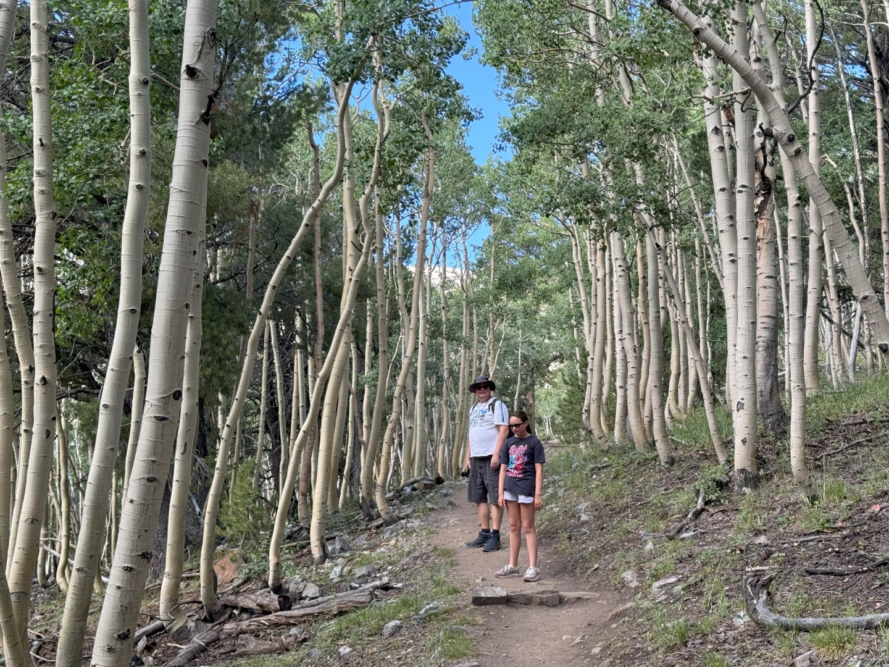
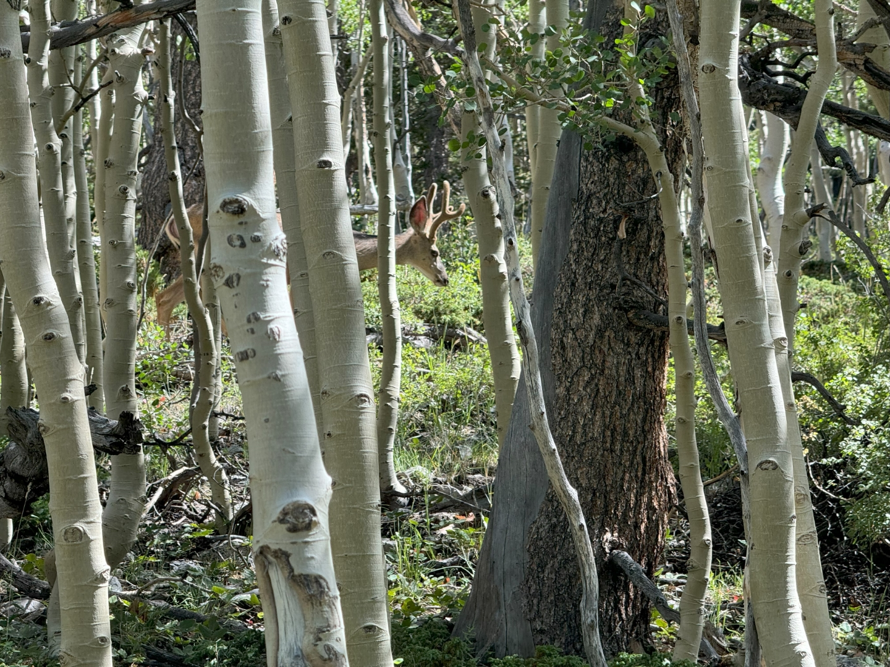
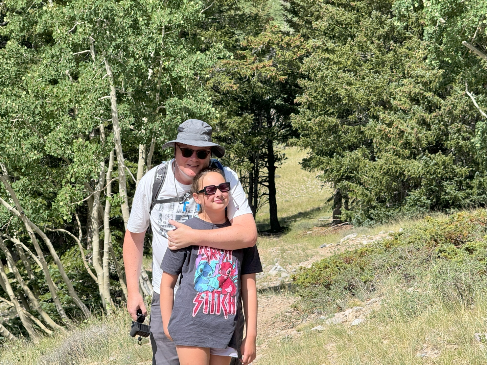
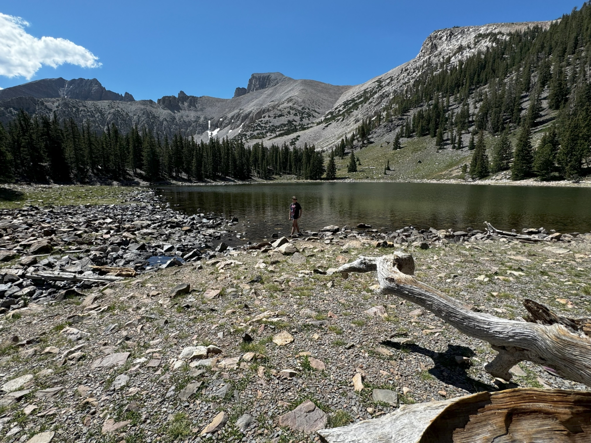
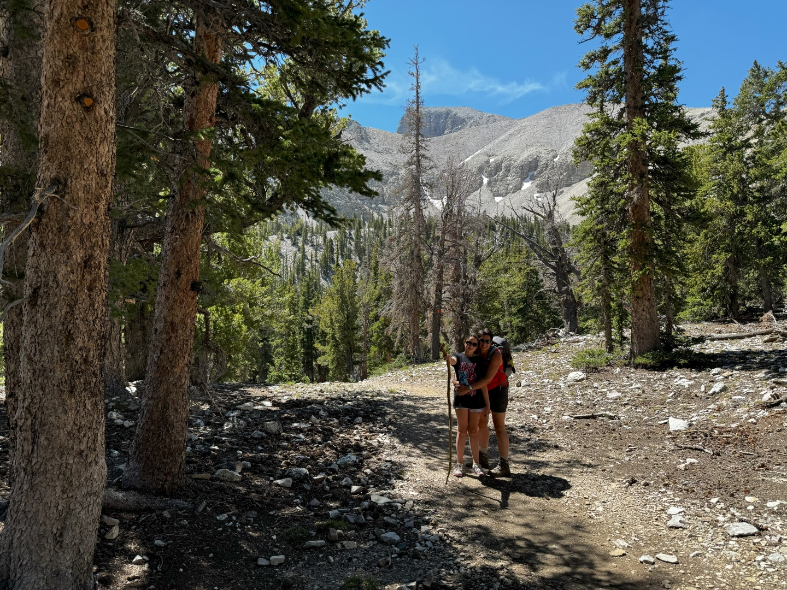
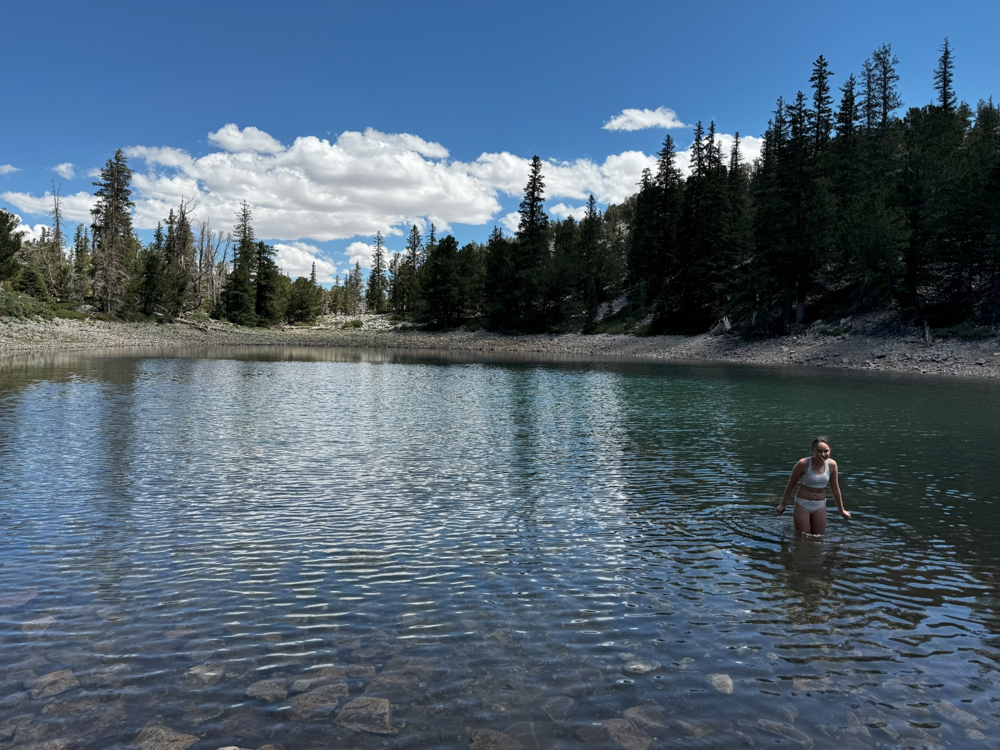
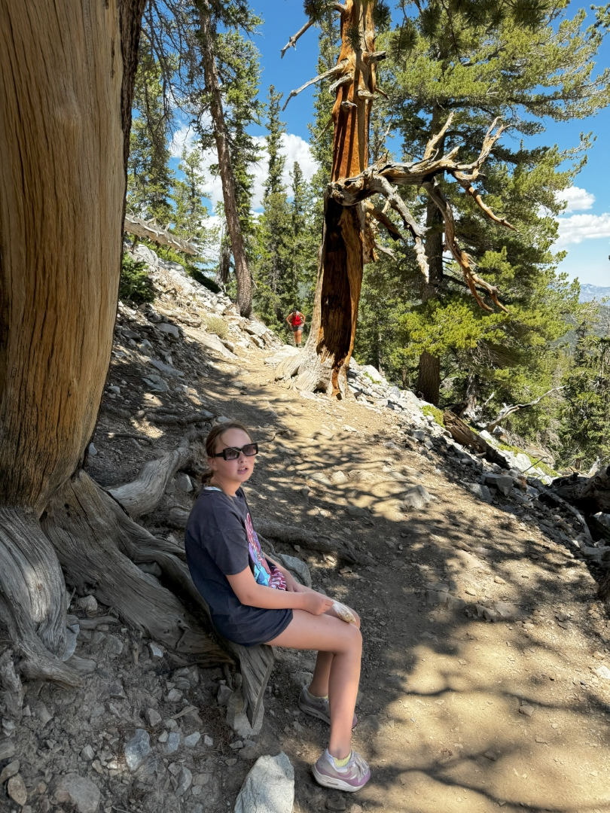
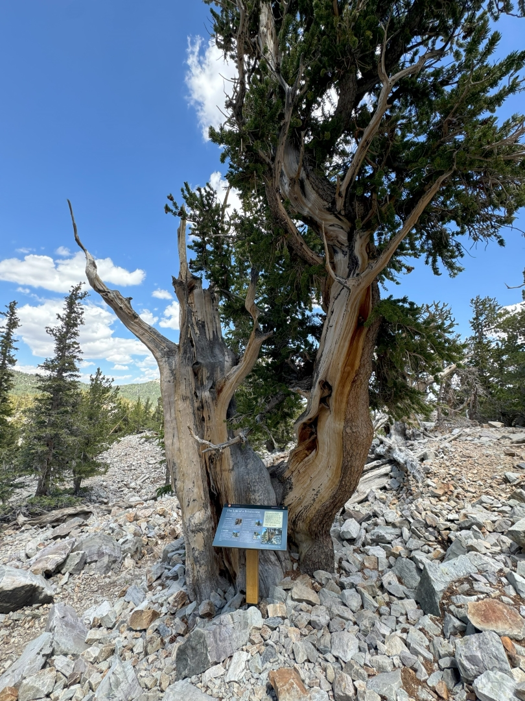
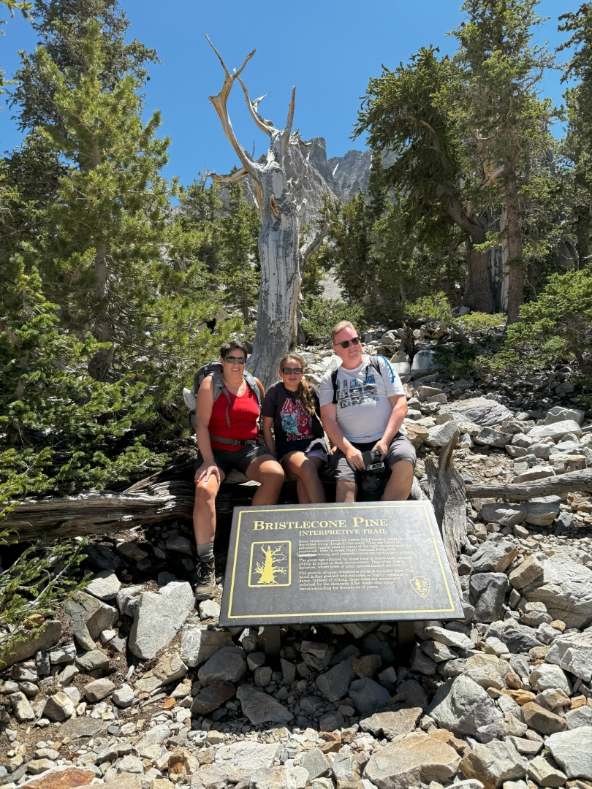

De reden dat we zo'n eind uit de bewoonde wereld zijn, is het nabij gelegen Great Basin National Park. Omdat het zo afgelegen ligt, komen er maar weinig bezoekers. En dat is jammer, want door de hoogte is de temperatuur aangenaam, en er is heel veel te zien qua natuur. Er zijn hoge bergen (3.5 km en hoger), meertjes en grotten. Die laatste laten we noodgedwongen voor wat het is, want we hadden van te voren kaartjes moeten regelen.

De dag begint vroeg, want er is maar weinig parkeergelegenheid bij de trailheads. Er wordt in het park hard gewerkt aan de wegen en campings, dus noodgedwongen parkeren we bij de Summit Trailhead. Toen wij daar rond half tien aankwamen, was die al heel goed gevuld. Via de Wheeler Peak Summit Trail duiken we meteen een mooi bos in met espen (ook wel ratelpopulieren) afgewisseld met dennebomen. Het pad heeft gelukkig maar heel weinig hoogteverschil, maar wel heel veel los liggende stenen, dus het is toch uitkijken geblazen.

We zien veel herten onderweg, maar amper mensen. Het uitzicht over de omliggende bergen is indrukwekkend.

Na ongeveer drie kwartier sluiten we aan bij de Alpine Lakes Loop Trail. Niet veel later komen we aan bij het eerste bergmeertje van vandaag: Stella Lake.

Sofie verruilt meteen de wandelschoenen voor de waterschoenen en gaat in het water. Na een kort onderhoud met een Amerikaanse meneer die met zijn Nederlandse vrouw in Heerhugowaard woont, gaan wij vrolijk verder naar het volgende meer voor vandaag.

Na ongeveer anderhalve kilometer komen we aan bij Teresa Lake. Ook hier gaat Sofie het water in, maar het is toch heel veel kouder dan gedacht, dus kopje onder gaat ze maar niet :-)

Iets voorbij dit meer nemen we de afslag naar de Bristlecone Trail. Dit pad van iets meer dan een kilometer lang gaat gestaag omhoog tot we bij een van de hoogtepunten (letterlijk ;-)) van dit National Park komen: een groep Bristlecone dennen. Inmiddels is het stiekem best warm geworden, en wandelen op 3500 meter hoogte helpt natuurlijk ook niet. Dus we lopen van schaduw naar schaduw om uit te rusten en wat te drinken.

Het bijzondere aan de Bristlecone Pine is dat deze dennen zeer oud kunnen worden (3000 tot 5000 jaar!) en zeer goed bestand zijn tegen barre weersomstandigheden en slechte bodems. Ze behoren dan ook tot de langstlevende levensvormen op aarde.

We zeggen deze bijzondere bomen vaarwel, en lopen via hetzelfde pad terug naar de splitsing met de Alpine Lakes Loop en vervolgen onze reis. Het laatste stukje lopen we over de weg terug naar de auto.

's Middags liggen we lekker in het zwembad en de hot tub bij het hotel, waarna we genieten van een super lekkere ribeye die we grillen onder het toeziend ook van een hele familie kalkoenen en herten.
