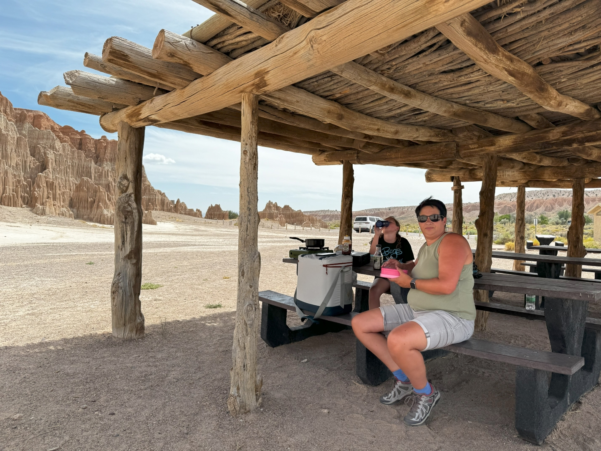
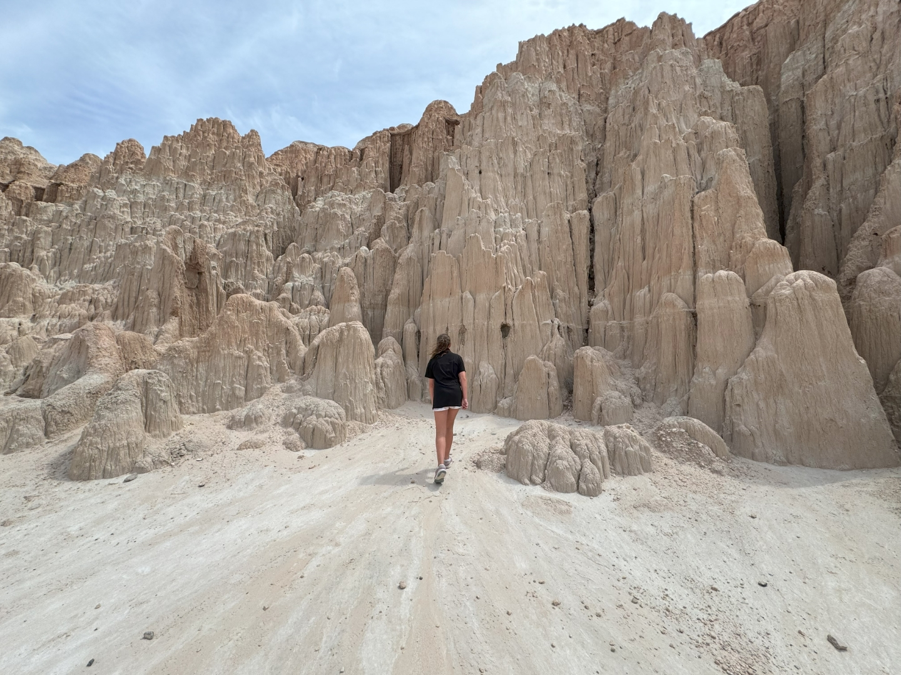
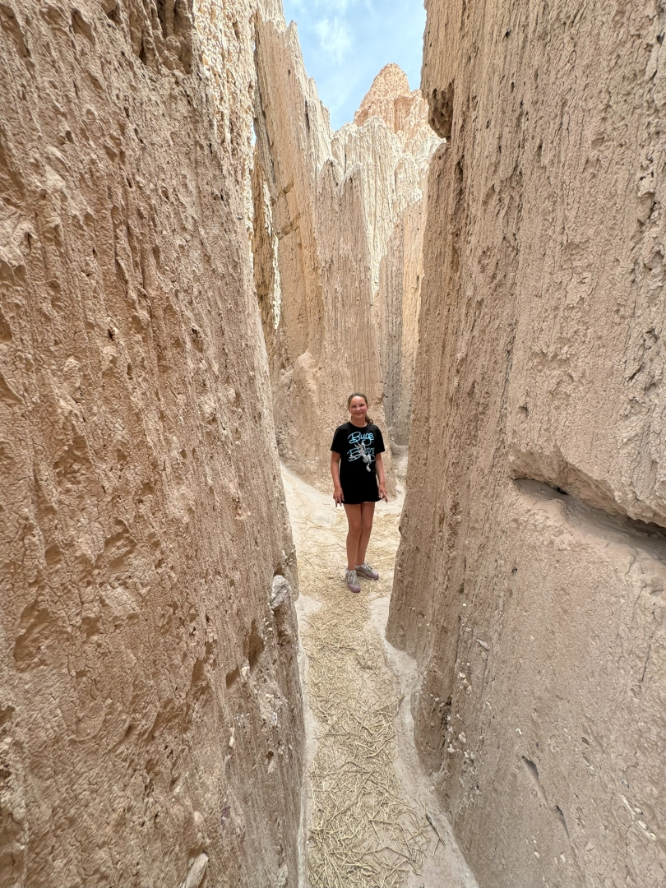
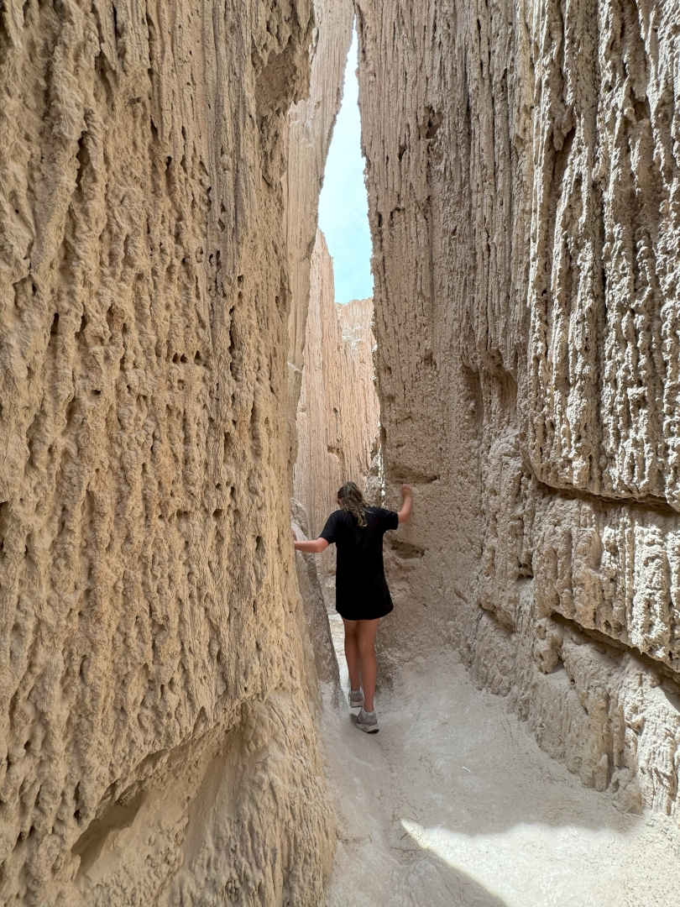
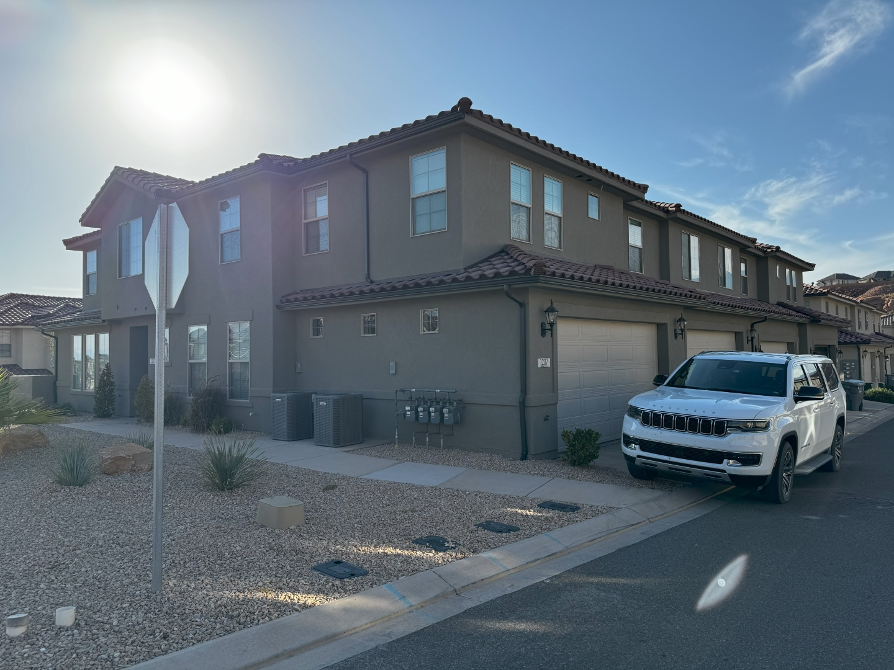
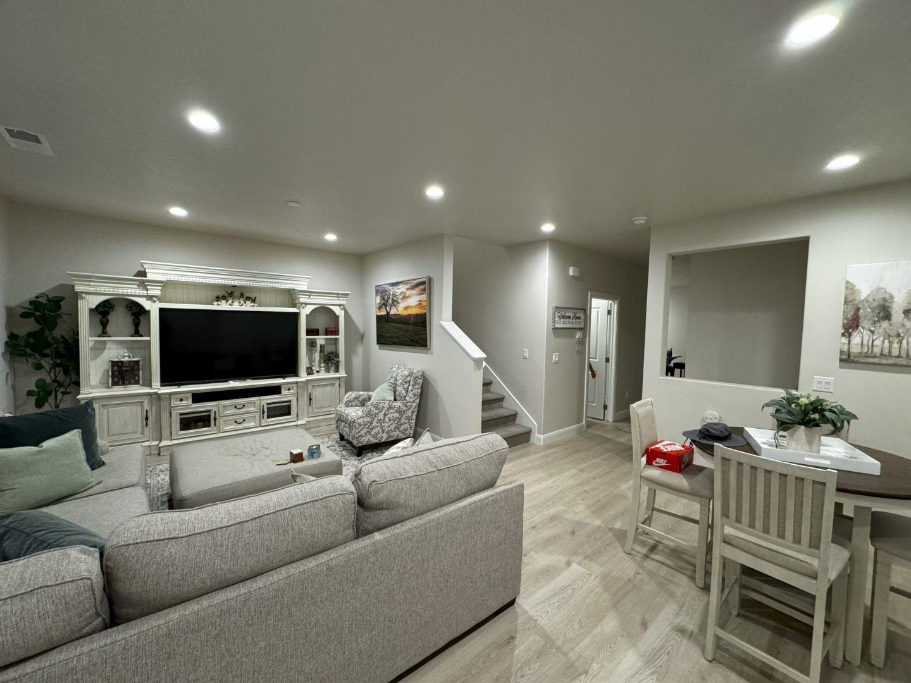

We worden vandaag op ons gemak wakker, ontbijten en brengen alle spullen weer naar de auto. We gaan Hidden Canyon Retreat verlaten. Wat een fijn plekje, we gaan het missen!

Via het Great Basin Visitor Center, Sofie heeft weer een badge verdiend, rijden we via de Nevada 487, 50 en 93 bovenlangs het park naar het zuiden. Met name de 93 is weer kaarsrecht.

We lunchen in Cathedral Gorge State Park, een overwacht pareltje. We zijn er helemaal alleen!

Door erosie zijn allemaal gangetjes ontstaan waar je tussendoor kan lopen.

Na nog ongeveer 2 uurtjes rijden komen we aan bij ons laatste huis in Washington, Utah deze vakantie. Het huis is voorzien van alle gemakken en is prachtig. We voelen ons meteen thuis. Vlakbij ligt een zwembad. De komende 6 nachten gaan we hier uitrusten van alle ervaringen en belevenissen van de afgelopen 4 weken.

Het is even passen en meten, maar met wat navigatie- en stuurmanskunst past de auto net in de garage.
