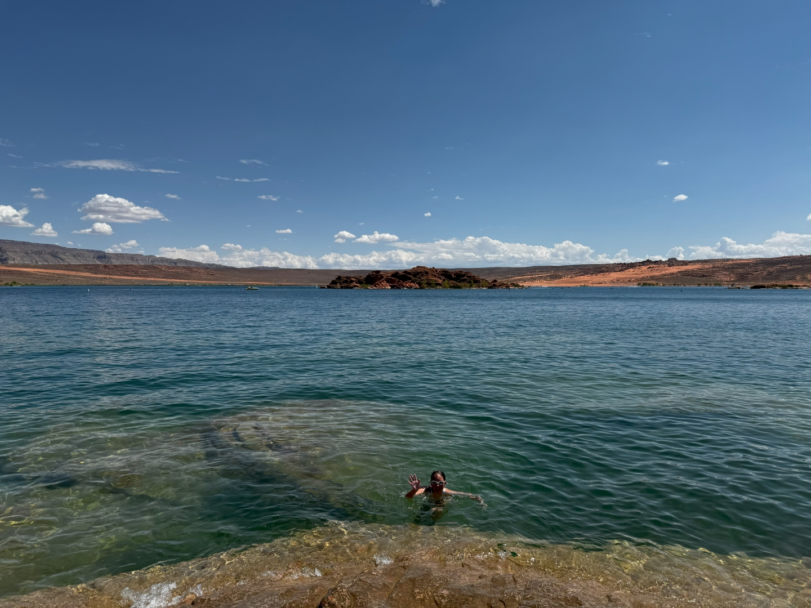
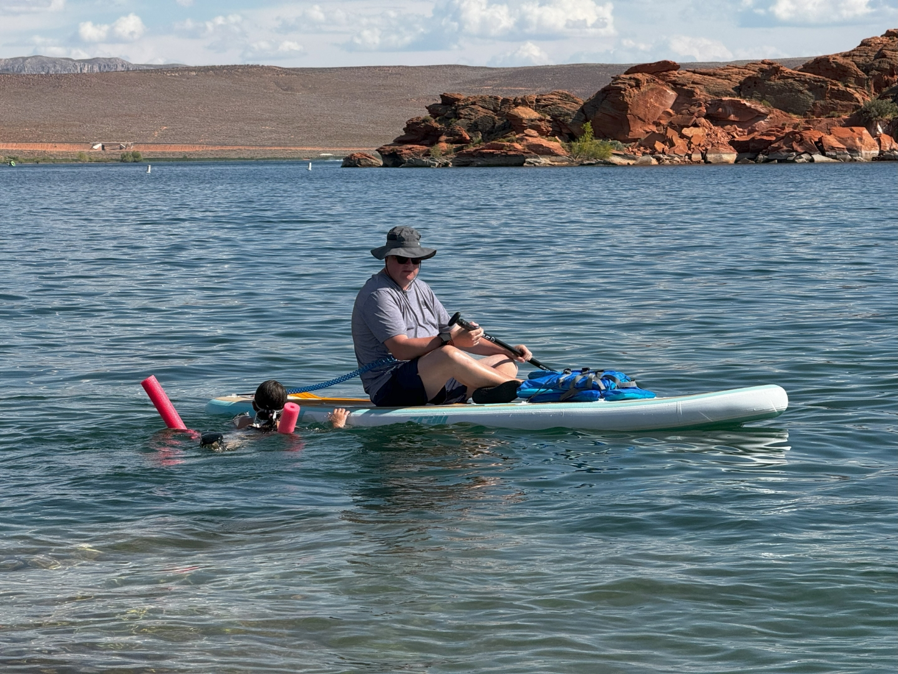

Op een half uurtje rijden ligt Sand Hollow State Park. Het park bevat een groot waterreservoir waarop je kunt varen, vissen, maar ook zwemmen.

Het water is heerlijk van temperatuur. Snel pompen we de sup weer op en gaan op pad.

We spenderen een paar uurtjes bij en op het water. Verder hebben we niet veel gedaan vandaag.
