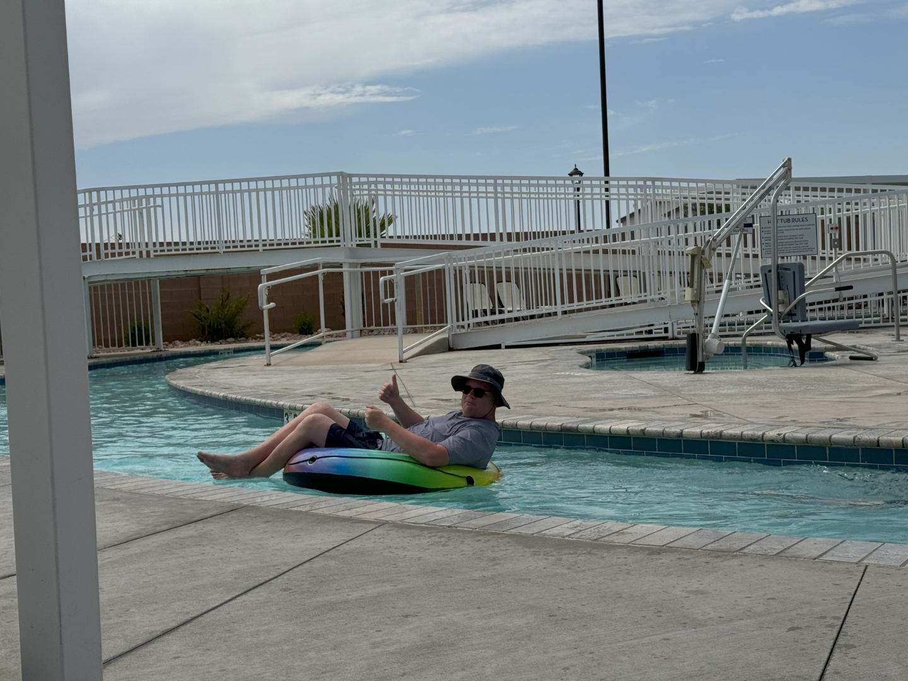
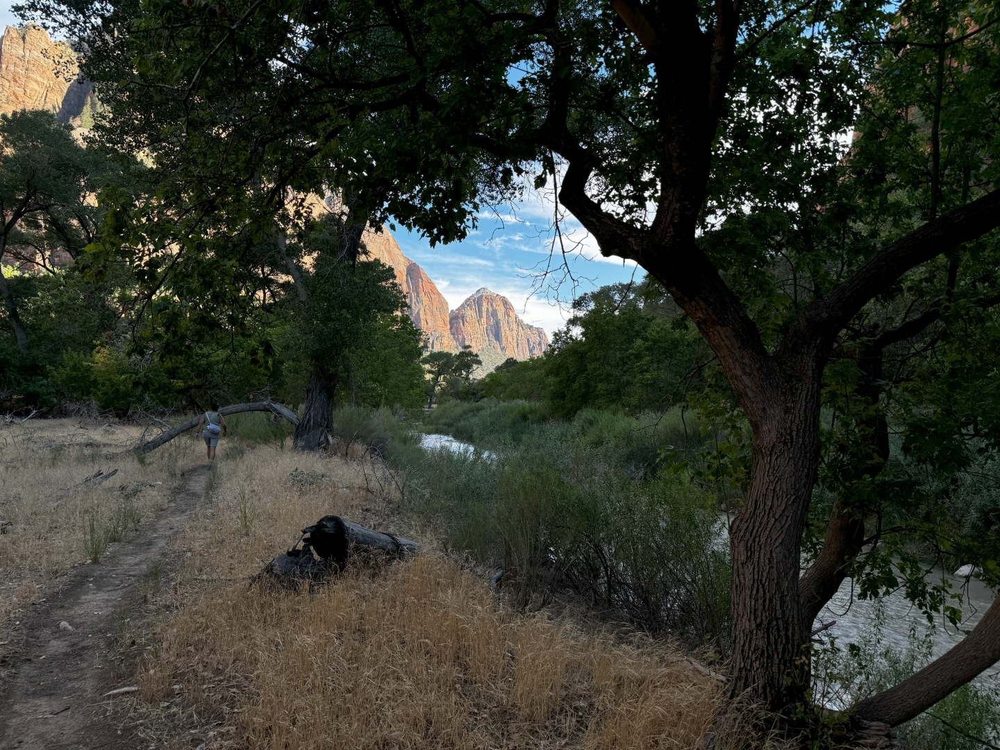
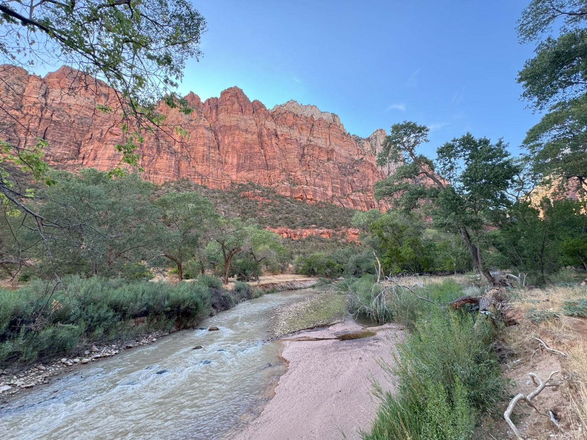
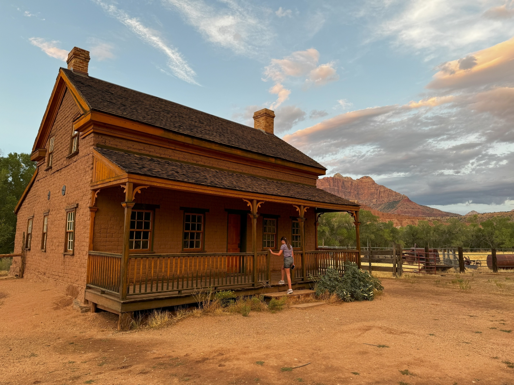
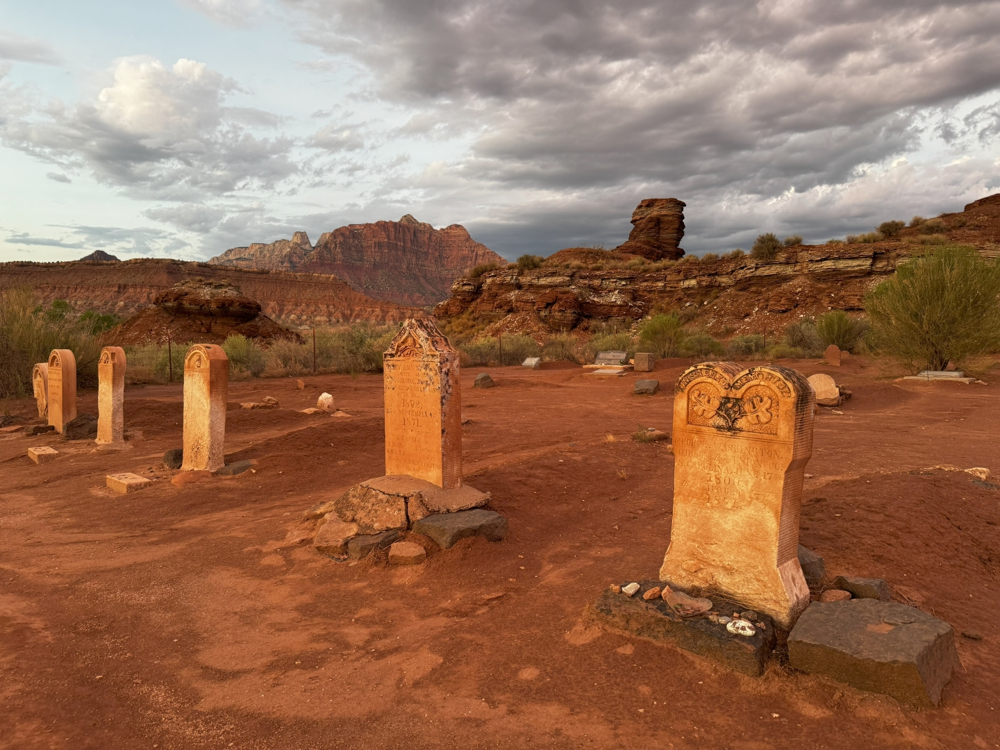

De dag beginnen we weer in het zwembad bij ons huis. In de ochtend en vroege middag hebben we het hele bad, en lazy river, bijna voor ons alleen.

Aan het einde van de middag rijden we naar Zion en pakken de shuttle bus naar de Zion Lodge. Het idee was om hier een ijs te gaan eten, maar het restaurant sluit al om vijf uur (!?!?!). We wandelen langs de Virgin River stroomafwaarts naar Court of the Patriarchs en komen onderweg veel herten en wilde kalkoenen tegen, maar amper mensen.

We eten in Springdale bij Bit and Spur, wat zeker voor herhaling vatbaar is. Nu we toch in de buurt zijn, bezoeken we nog het spookstadje Grafton. Met de ondergaande zon en de dramatische bergen op de achtergrond, levert dat mooie plaatjes op.

In 1864 woonden hier 28 families, maar vanwege het regelmatig overstromen van de Virgin river en aanvallen van Indianen, zijn de meeste mensen in de loop der tijd vertrokken. De laatsten hielden het vol tot 1944.

Enkele scenes uit de film Butch Cassidy and the Sundance Kid zijn hier opgenomen.

Net voordat het helemaal donker is, rijden we terug naar huis.
