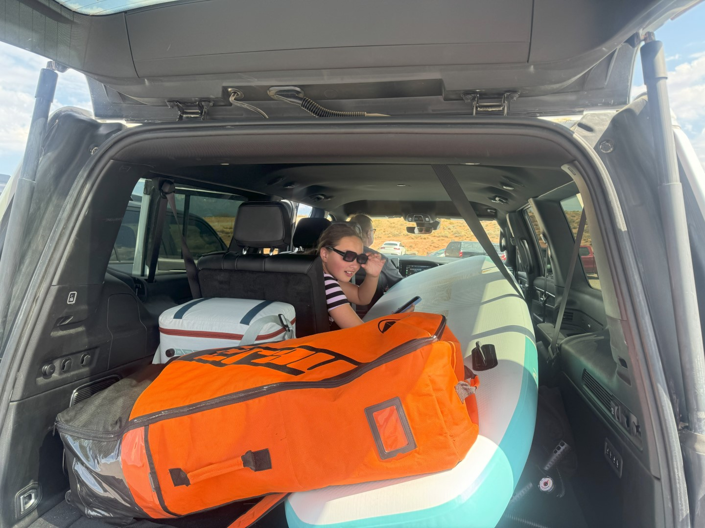
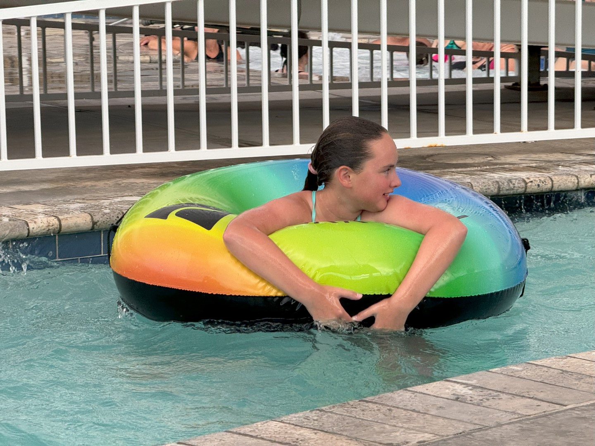
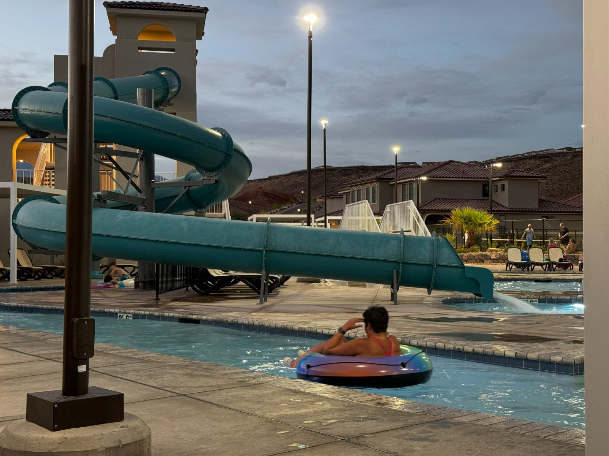

Vanmorgen gaan we om de weekenddrukte voor te zijn weer op tijd naar Sand Hollow State Park. Wanneer we de stoelen op rij 1, 2 en 3 plat leggen, kan de sup volledig opgeblazen in de auto! Dat scheelt een boel opblaaswerk :-)

Bij aankomst valt de drukte heel erg mee gelukkig en we vinden al snel een mooi plekje.

De hele tijd hangt er een dreigende donkere wolk boven de overkant. Aan het einde van de middag steekt ineens de wind op en wordt de lucht zwart. Snel pakken we onze spullen en duiken in de Jeep.

De rest van de middag spenderen we bij het zwembad. Het rommelt hier wel af en toe, maar het blijft droog. En dus worden wederom de nodige meters gemaakt in de lazy river.

We blijven tot het donker wordt.

