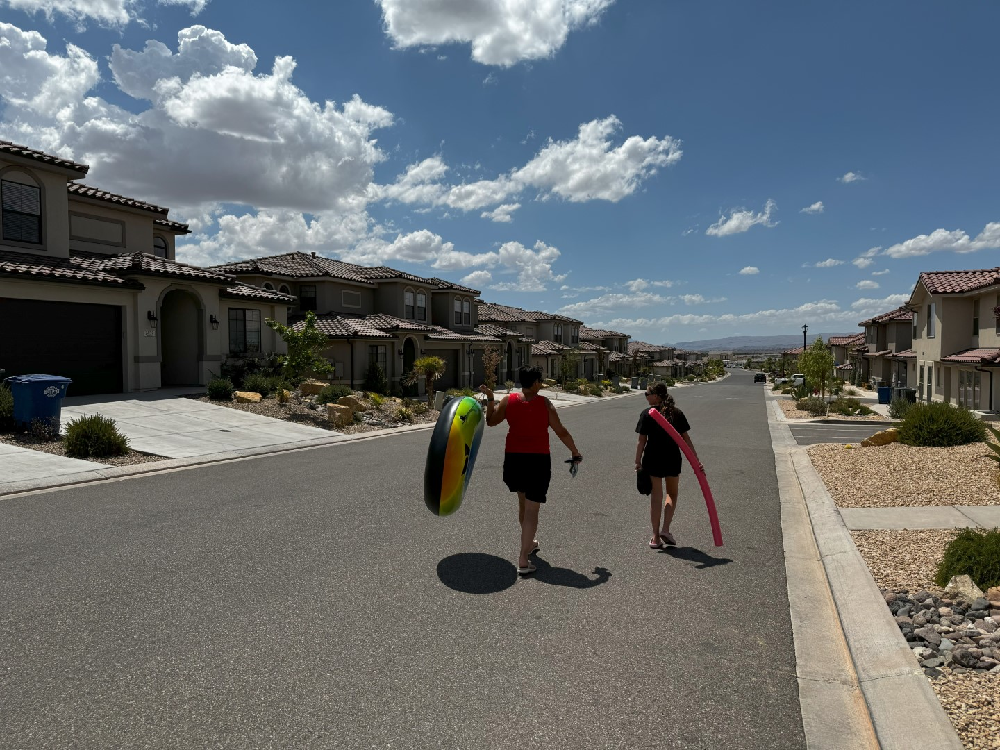
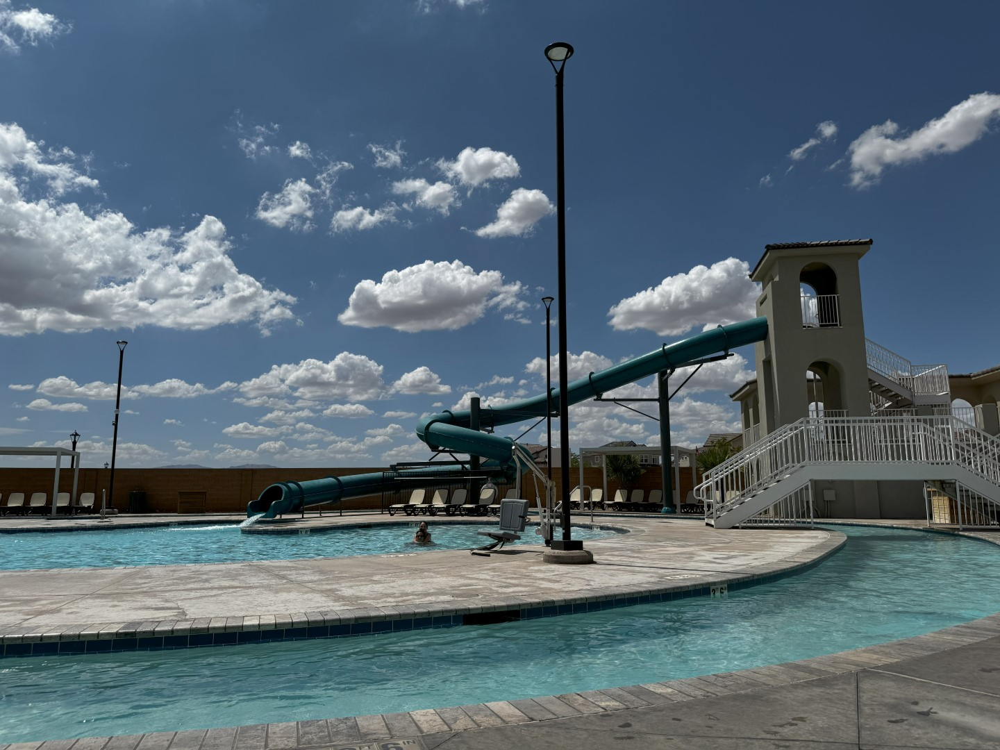
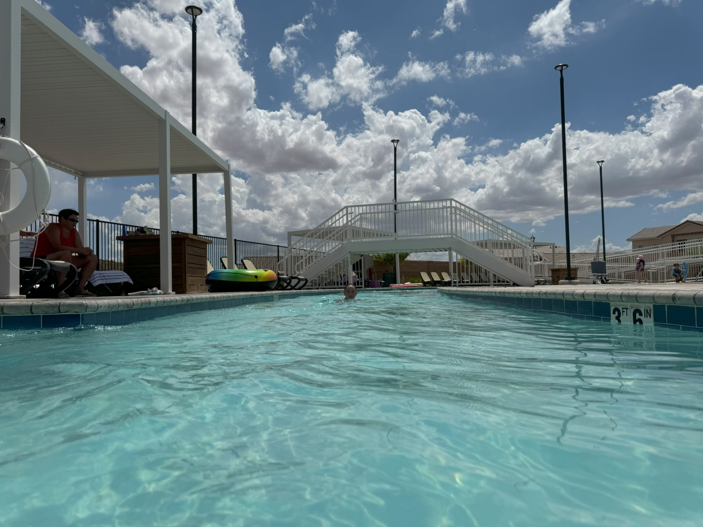
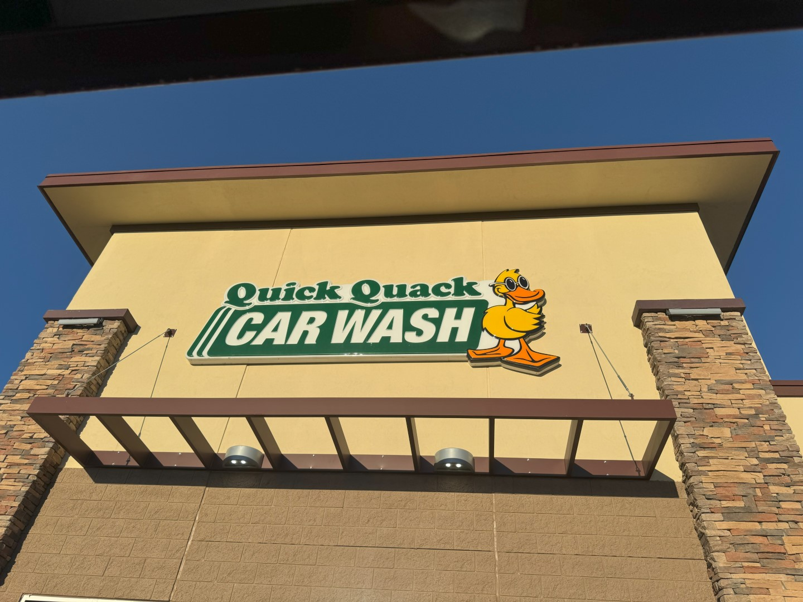

Gisteravond hebben we de koffers al zo ver mogelijk ingepakt. De sup past prima in de koffer, dus die kan mee terug naar Nederland. Vandaag is onze laatste volledige dag, dus we willen afsluiten in stijl. Nu hadden we gepland om te gaan tuben in de Zion river, maar door het slechte weer van gistermiddag is het helaas niet mogelijk. Er ligt te veel troep in het water, en dus is het niet veilig om op een band anderhalf uur stroomafwaarts te dobberen.

Jammer, maar helaas.

En dus gaan we maar weer naar ons zwembad. Het is extreem rustig, dus we hebben alle tijd en ruimte om te zwemmen en chillen op de ligbedjes.

's Avonds gaan we weer eten bij Texas Roadhouse en uit goed fatsoen rijden we de auto even door de wasstraat.

