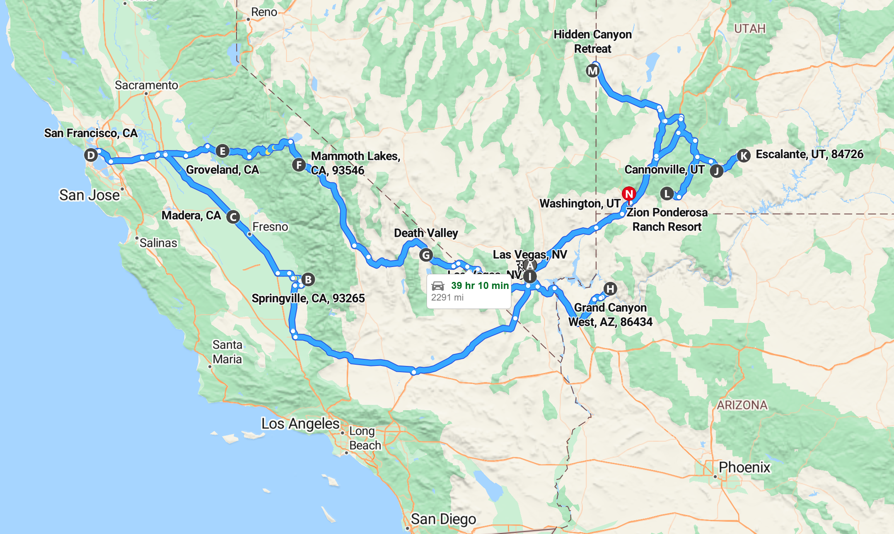
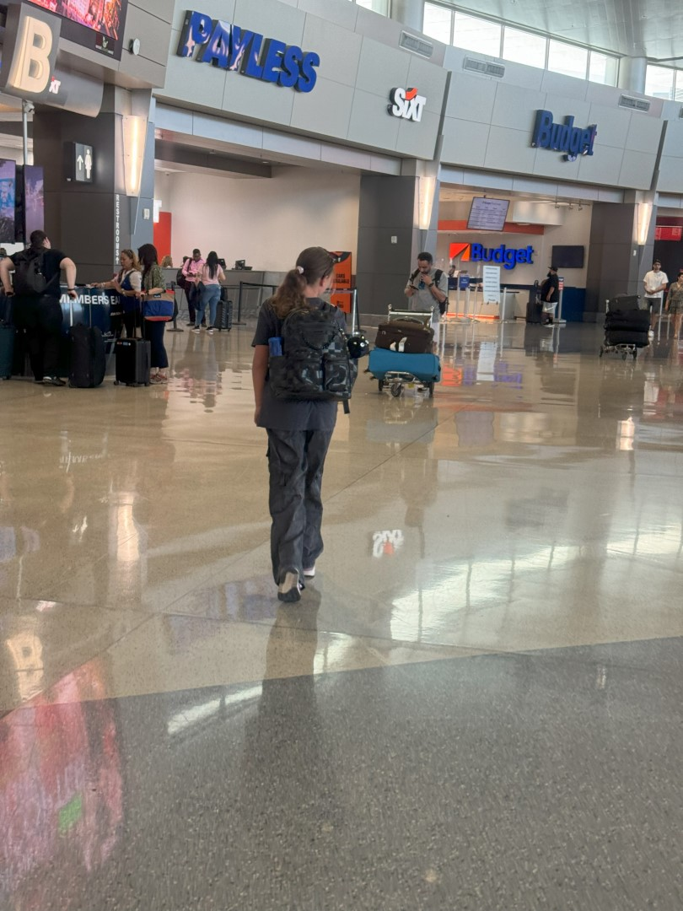

En zo is de laatste dag van onze rondreis al weer aangekomen. In totaal hebben we ongeveer 3700 kilometer gereden in 33 dagen, dus ongeveer 112 km per dag.

Hoogtepunten waren toch weer Las Vegas en de nationale parken Zion en Yosemite, maar zeker ook Mammoth Lakes en Great Basin heeft ons positief verrast. Het slapen op bijzondere plekjes is ons ook goed bevallen: de tipi en de dome, maar ook het tiny house in Escalante waren helemaal top!

Om stipt 11 uur sluiten we na 6 nachten met pijn in het hart de deur op 1207 Mistico Aly in Washington, Utah. Wat een geweldig huis op een prima locatie. We voelden ons erg thuis hier. Het voelt gek om na bijna 5 weken weer een lange broek aan te hebben.

Rest ons nog de rit van 2 uren terug naar Las Vegas. Het inleveren van de auto bij Alamo gaat erg vlot.

De shuttle bus brengt ons met al onze tassen naar Terminal 3. Het inchecken en de security check gaan snel, en dus hebben we alle tijd om onze laatste dollars uit te geven aan de lunch. De vlucht naar Amsterdam met KL636 duurt 9.5 uur, en dat blijft een hele zit. Maar goed dat we de vesten in de rugzak hadden zitten, want het was bij tijd en wijle steenkoud! Iets na 11 uur in de ochtend landen we weer veilig in Amsterdam.

De rij voor de douane is lang, maar het gaat toch redelijk snel allemaal. Toen we aankwamen bij de bagageband, zagen we net dat onze koffers keurig achter elkaar de band op rolden. En dus waren we snel weer bij P3 om de auto op te halen (wat is 'ie klein zeg vergeleken met de Jeep!). Een uurtje later waren we thuis, en kon het grote uitpakken en proberen wakker te blijven feest beginnen.
