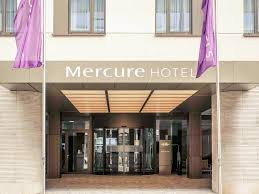
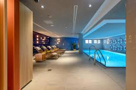

Om half twee trekken we de voordeur dicht van ons huis en rijden richting hotel Mercure in Wiesbaden, onze tussenstop deze keer. Op papier is het 4 uur rijden, maar vanwege de drukte onderweg komen we pas rond half zeven aan. Het is een prima hotel midden in het centrum met een eigen ondergrondse parkeerplaats. Parijse toestanden! De parkeerplekken zijn erg krap, maar met wat stuurmanskunst weten we de voiture toch zonder brokken te maken in te parkeren.

Omdat we wat aan de late kant zijn, eten we in de bar van het hotel. Zowel de schnitzel als de hamburger zijn verrassend lekker. Hierna gaan de dames nog even een duik nemen in het zwembad.

We gaan vroeg slapen, want we willen morgen op tijd vertrekken naar Schluchsee.
