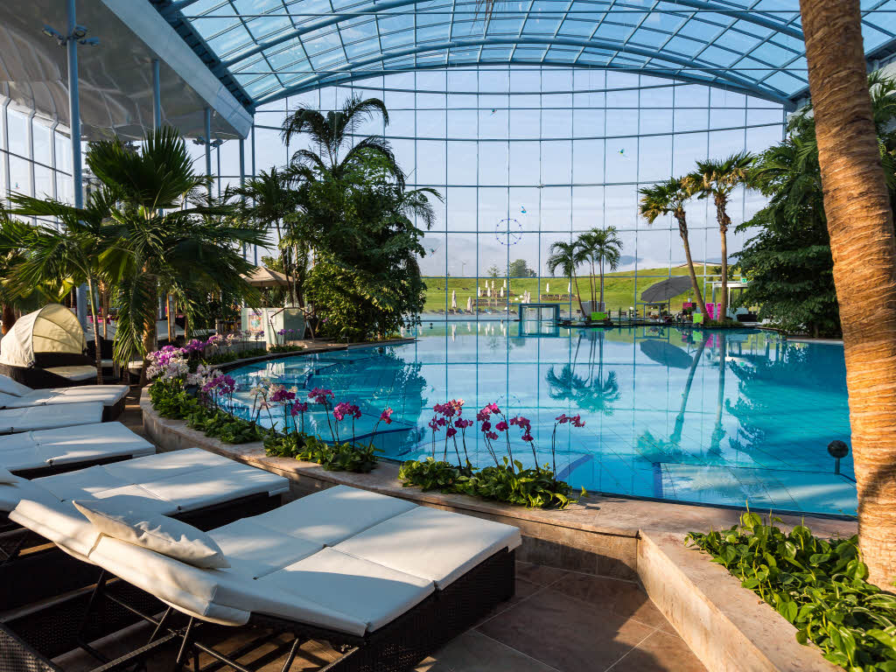

Het Badeparadies in Titisee, een half uurtje rijden vanuit Schluchsee, staat vandaag op het programma. Voorheen mochten kinderen jonger dan 16 niet in de Palmenoase, maar sinds kort wordt dit onderdeel van het Badeparadies voor die doelgroep in het weekend wel opgesteld. Gelukkig maar, want hier heerst relatieve rust en bestaat het vertier niet alleen maar uit glijbanen en golfslagbaden. We hebben een heerlijk prive bedje gehuurd waar we in alle rust wat kunnen chillen en lezen.

We wisselen de rust af met de 23 glijbanen in Badeparadies Galaxy zodat ieder van ons aan zijn trekken komt.

's Avonds om acht uur laten we het voor wat het is en rijden weer terug naar Schluchsee.
