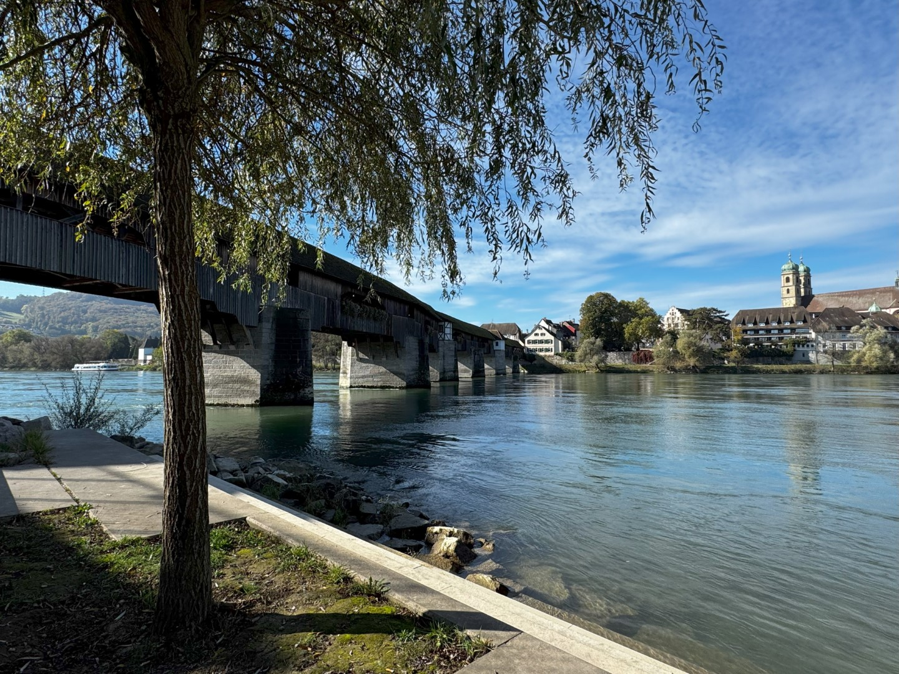

Bad Säckingen is een heel leuk stadje gelegen aan de Rijn op de grens met Duitsland en Zwitserland.

Als eerste bezoeken we de kloosterkerk Sankt Fridolin, met twee markante torens met uivormige koepels.

Vanuit het stadje voert een overdekte houten brug uit de 15e eeuw over de Rijn naar Zwitserland. Het is met 203 meter de langste houten overdekte brug van Europa.

We lunchen op de oever aan de Duitse kant en genieten van een heerlijk zonnetje en van de van huis meegebrachte broodjes. Vervolgens wandelen we over de brug naar de overkant.

Aan de Zwitserse kant gaan we nog even rustig op een bankje zitten en genieten van het uitzicht over de stad.

Terug aan de Duitse kant wandelen we nog over de lokale jaarmarkt met heel veel kraampjes met kleren, rommel, en eten. Heel veel eten.

De middag spenderen we in het zwembad en sauna van ons appartement.
