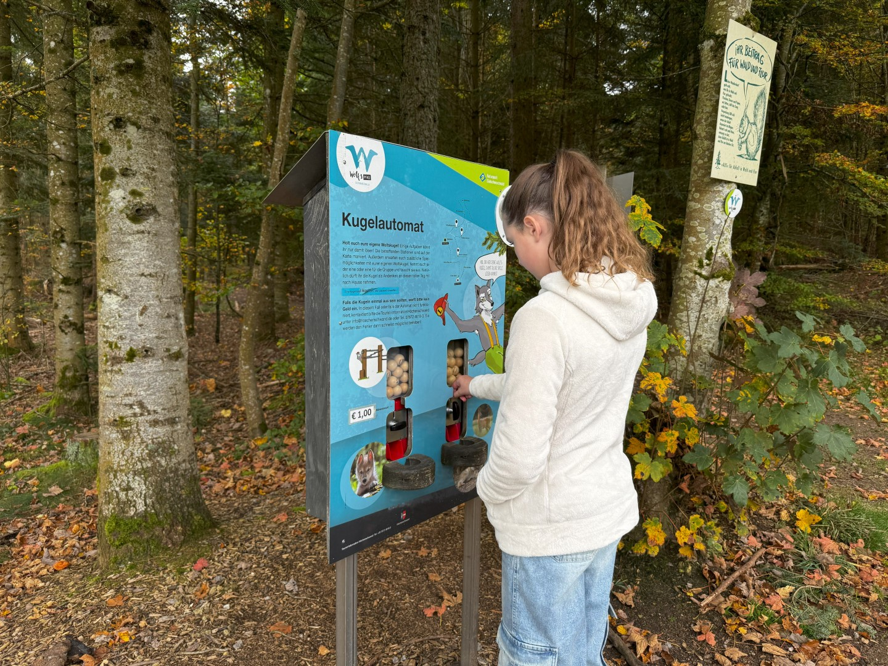
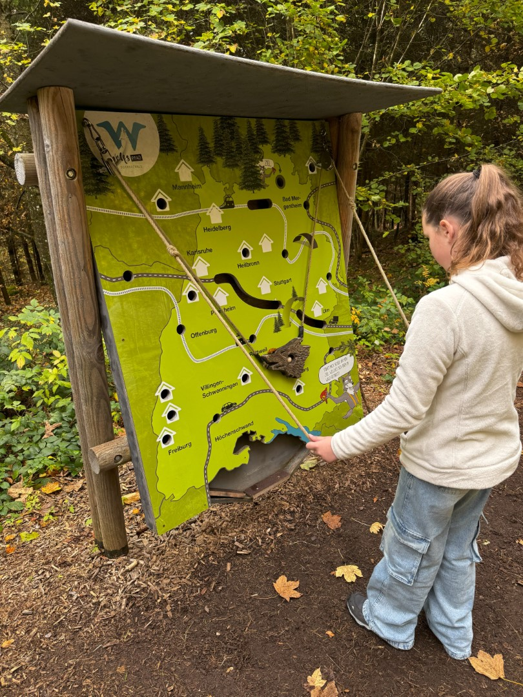
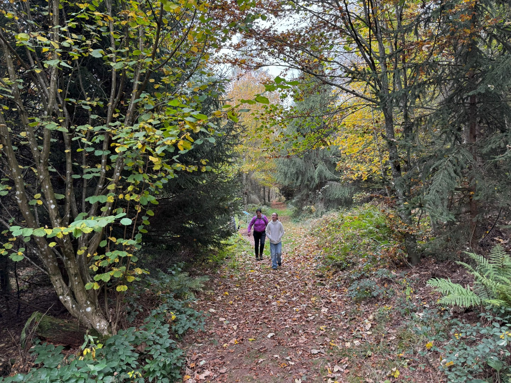
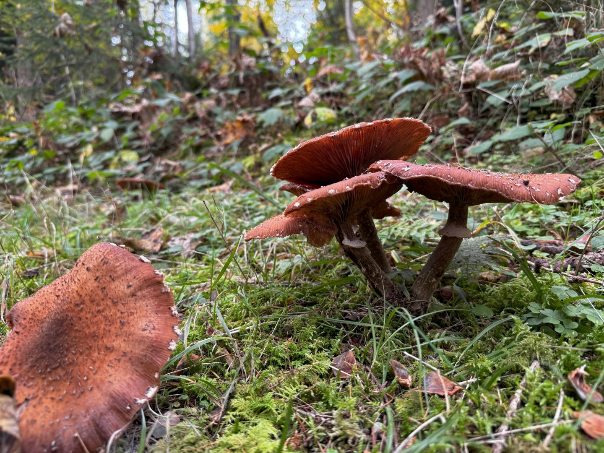
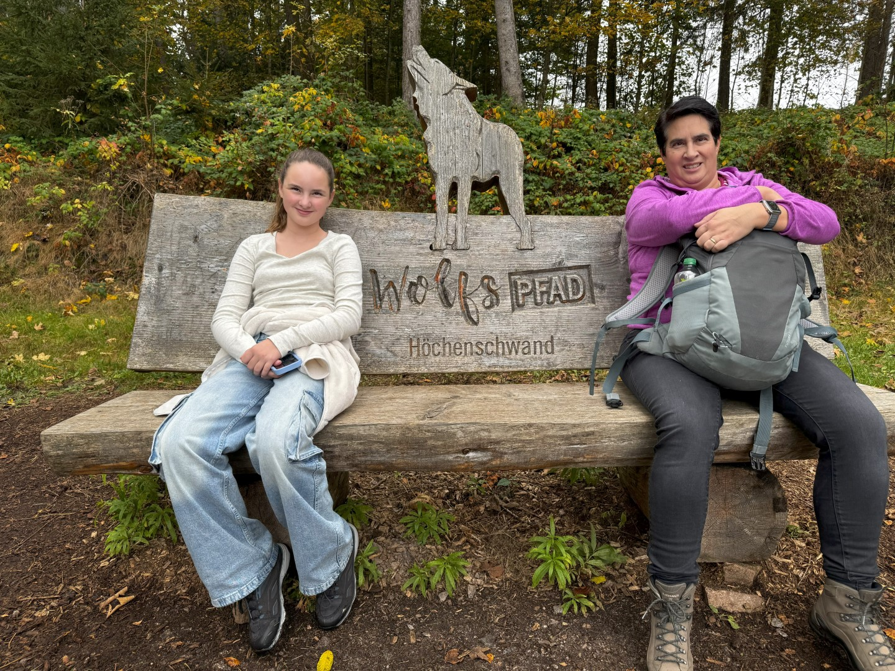
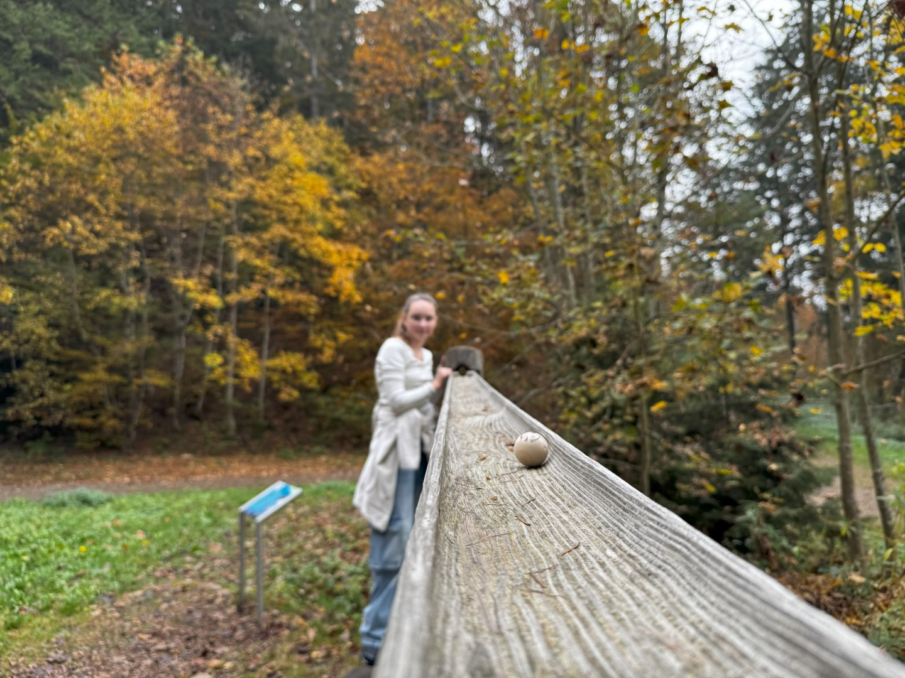
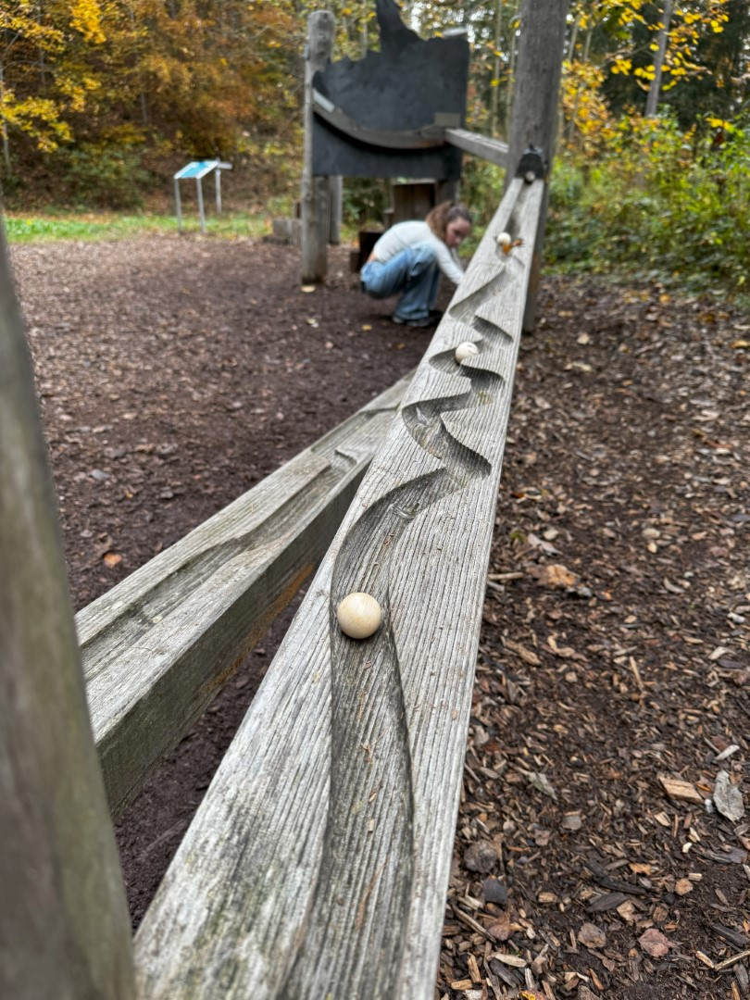

Vandaag staat een klein beetje actie op het programma. We rijden met de auto naar Höchenschwand want hier is het Wolfspfad. In een prachtig bos hebben ze een werkelijk schitterende wandeling uitgezet van een kilometer of 4. Op het pad staan veel informatieborden over het leven van de wolf. Om het allemaal wat interessanter en interactiver te maken, kun je bij de parkeerplaats een houten kogel kopen. Deze heb je nodig op een aantal spelletjes en knikkerbanen gelegen aan het wandelpad.

Als snel duikt het eerste spel op. Met twee touwen moet je de kogel naar het eindpunt brengen.

Het is heerlijk weer en we genieten van de herfst.

Af en toe gaat het pad behoorlijk steil omhoog, maar gelukkig staan er veel bankjes waar we dankbaar gebruik van maken.

Na een uurtje wandelen komen we aan bij de knikkerbaan. Deze is behoorlijk groot en zit vernuftig in elkaar.

Bij de knikkerbaan eten we ook de broodjes op en daarna wandelen we weer terug naar de auto. De rest van de middag spenderen we weer bij ons appartement in het zwembad en de sauna.
