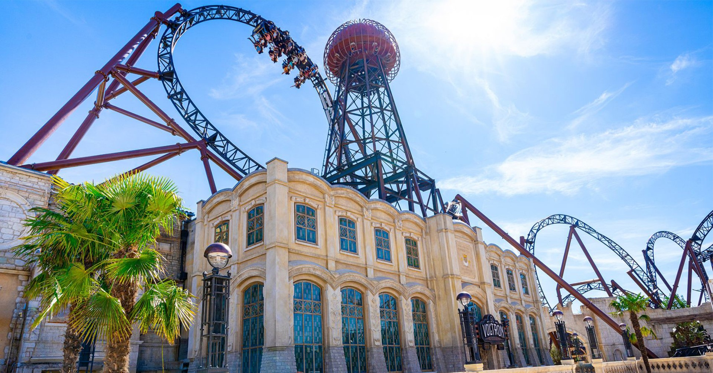
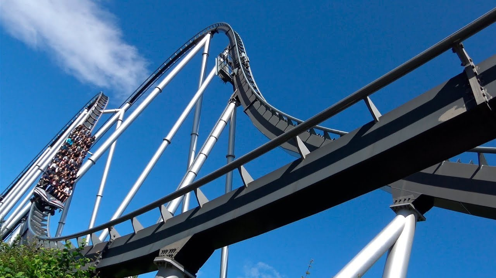
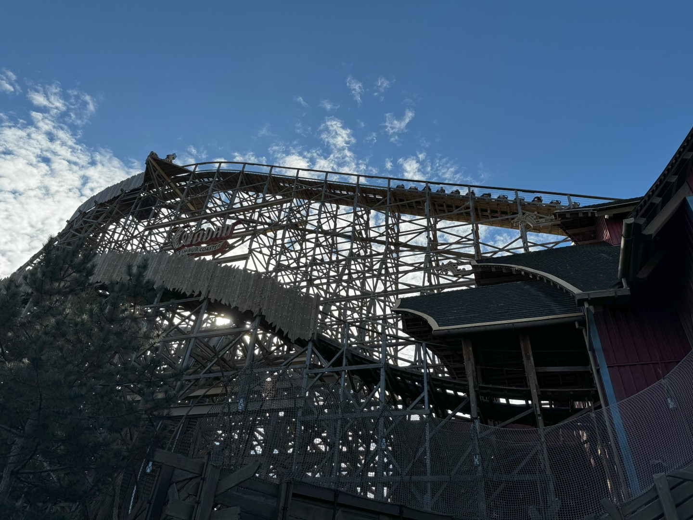

Chantal blijft vandaag thuis om wat te studeren. Sofie en ik rijden in alle vroegte naar Europapark. De drukte bij aankomst op het parkeerterrein belooft niet al te veel goeds voor de wachttijden. Maar gelukkig is het een enorm groot park met bijna 100 attracties waardoor al het volk goed verdeeld wordt. Al met al vallen de wachttijden best mee.

Als eerste gaan we naar de nieuwe achtbaan Voltron. Wow! Met een lengte van 1385 meter is het de langste lanceerachtbaan van Europa. Bezoekers ervaren tijdens de rit 2.2 seconden gewichtloosheid. Het blijkt dat ik daar niet heel goed tegen kan. Met zwabberende benen en een omgekeerde maag stapte ik uit.

Hoog tijd dus om wat tot rust te komen, en dus bezoeken we het spookhuis en een ander rustig ritje. Hierna is het weer tijd voor wat actie, en wel in de vorm van de Silver Star. Het was met zijn hoogte van 73 meter tot 2012 de hoogste achtbaan in Europa.

Tijdens de rit had ik al spijt. Groen en geel kwam ik er uit, hard op zoek naar een plekje waar ik ongezien over m'n nek zou kunnen gaan. Gelukkig kwam het niet zo ver. Na een rustige lunch met wat water kwam ik weer bij zinnen.

De rest van de dag hebben we niet al te wilde attracties gedaan. Sofie is alleen in de houten achtbaan Wodan gegaan. Onze kleine held!

Na de heerlijke frietjes in Themenbereich Holland zijn we weer terug gereden naar Schluchsee.
