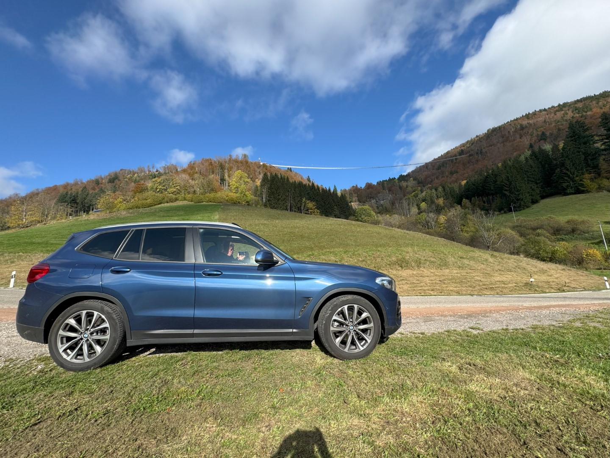

In het verleden zijn we al eens bij de Todtnauer Wasserfall geweest. Sindsdien hebben ze over die waterval een hangbrug gebouwd die het hele dal overspant. Het is een spectaculair bouwwerk met prachtige uitzichten over zowel de waterval als de omliggende bergen.

De brug zelf is 450 meter lang en je hangt 120 meter boven de grond.

De herfstkleuren zijn prachtig! We wandelen rustig naar de overkant. Bij tijd en wijle wiebelt de brug heel behoorlijk en moet je je echt wel vasthouden aan de railing.

Bij de overkant aangekomen eten we onze broodjes op.

Op de weg terug naar Schluchsee stoppen we nog even aan de kant van de weg. Van hieruit kun je goed zien hoe groot de brug wel niet is.

's Avonds eten we voor de eerste keer deze week bij Seehof, ons favoriete restaurant in Schluchsee.
