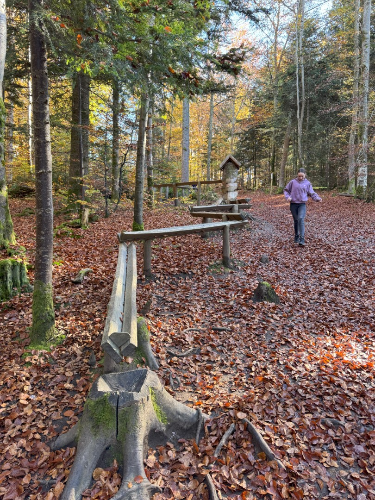
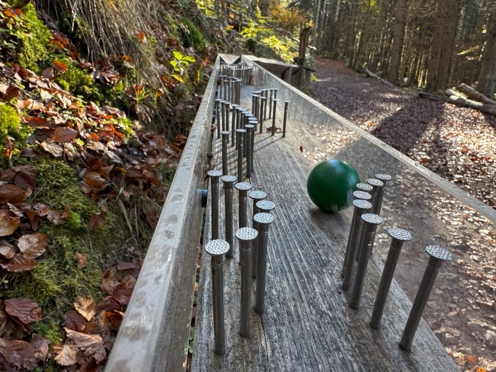
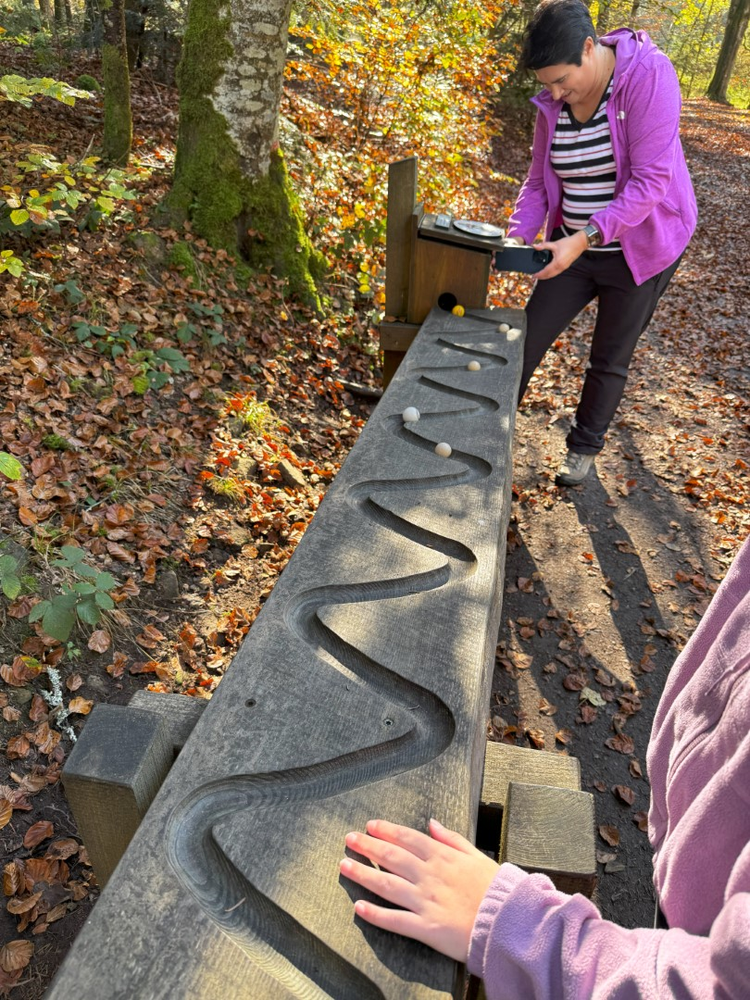
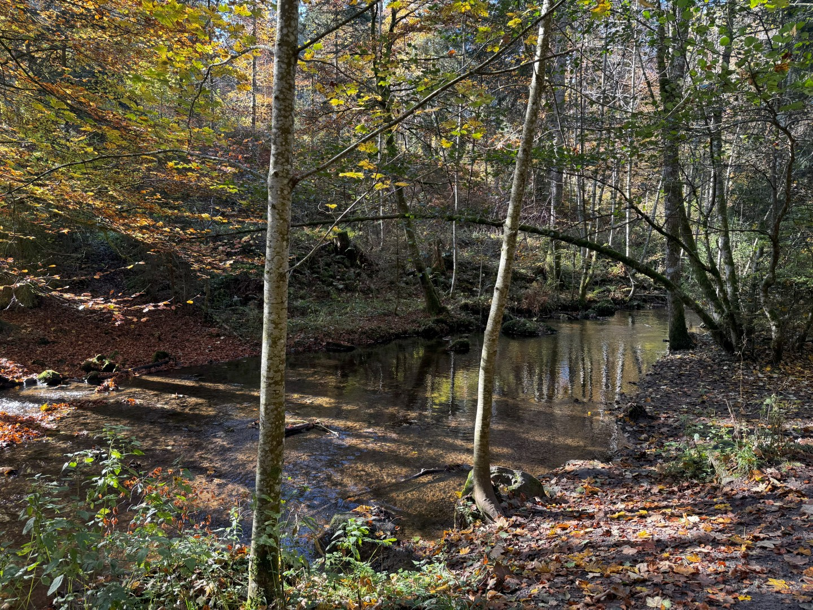
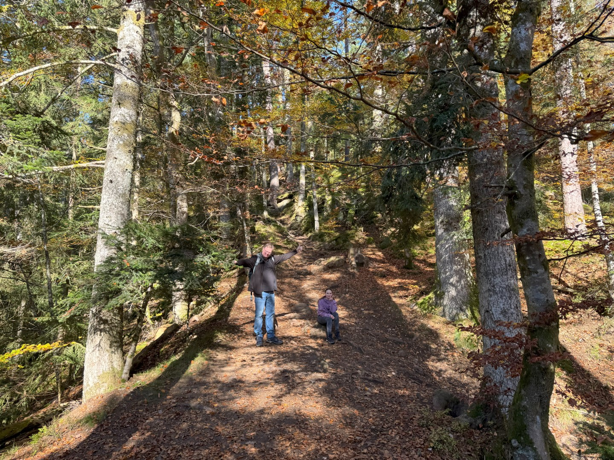

Vlakbij Birkendorf hebben we een nieuwe knikkerbaan wandelpad ontdekt. Bij de parkeerplaats kopen we drie nieuwe ballen. Vol goede moed duiken we het Kugelwaldpfad op. Het thema is houtbewerking, dus de banen zijn voorzien van allerlei gereedschap om het geheel op te leuken.

Onderweg leren we van alles over de houtbewerkingstradities en het dierenleven alhier.

Al met al is het een erg leuk wandelingetje.

De rest van de middag wordt weer doorgebracht in het zwembad en de sauna. 's Avonds eten we weer bij Maria in restaurant Seehof. Na het eten pakken we alle koffers weer in, want morgen moeten we helaas al weer naar huis.
